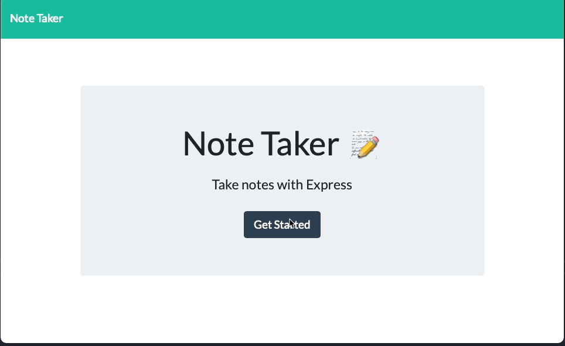
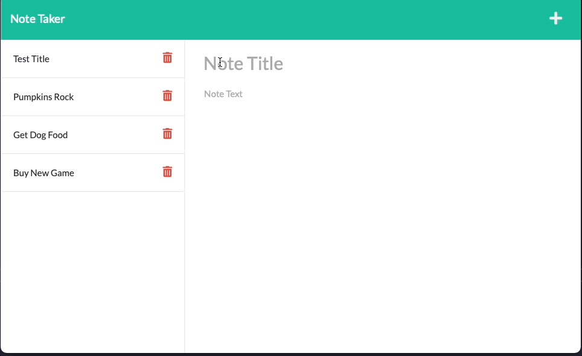
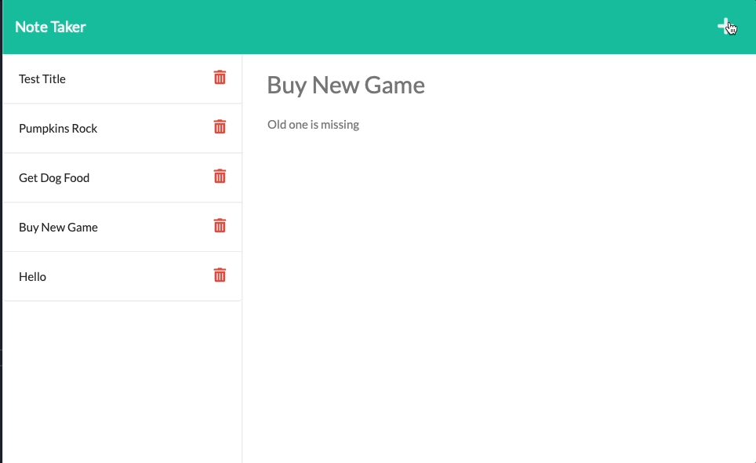
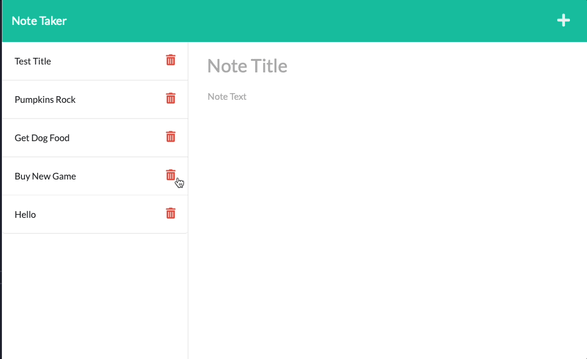
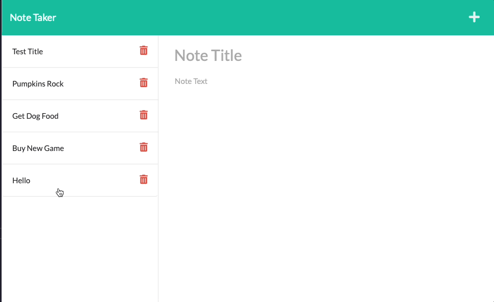

# Notes_Taken_A_Very_Particular_Set_of_Skills_TT

  ## Table of Contents
  * [Description](#descrip)
  * [Installation](#install)
  * [Usage](#usage)
  * [Contributions](#contri)
  * [Tests](#tests)
  * [Contact & Qustions](#contact)
  * [License](#license)
  * [Powered By](#powered-by)
  
  ### Description:
      As the days shortened and the light became less harsh, the tired traveler realized that the season's changing mirrored the reality of his life.  The journey had been difficult up to this point, but the real challenges were still in front of him.    
      With this brief moment of rest, he realized that it might be good to have a place to note things that he still needed to do.  He wished for one of those traveling song writers that would chronicle his adventures as he went.  Not only would the company be a welcome change, but it would give him another way of remembering all the things that he had quickly forgotten.  
      The darker arts had not been his friend as of late, but he figured that he could call on the powers once again to produce something that would allow him to remember!    
      Hours passed and his concentration began to wane.  "Why was it so difficult to do something seemingly so simply," he thought.  He had previously tried this spell, and had something to start from.  Slowly the routes were made and the connections were tested.  While they were not the strongest, he realized that dawn would soon be approaching, and with daylight, the adventure would continue.  While he wasn't a true heroku, his work would have to do.  "Half working is still working," he mused to himself.    
      While this journey seemed endless the sun had broken the darkness, he braced himself and moved forward because the new light wasn't as warm as it once had been but would still comfort him as he continued his journey...

  
  ### Installation:
  Vist the Webpage

  [notes taken](https://notetaken-21-tt.herokuapp.com/)

  Click on the "Get Started" Button  
  

  To add a note, simply click in the text box and add your title.  Click in the body and add any additional details that you may need.  To save, click the disk in the upper right corner that will appear when both fields have information.
  

  If you are viewing a note and think of something else that needs a note, you can click the plus sign in the upper right to add a new one.

At anytime, you can click on the notes on the left column and see your old Notes and the information that they contain.  

Finished with a note? You simply click on the trashcan next to the note and remove it!  

  
  ### Usage: 
      To keep track of notes

  
  ### Contributions:
      N/A

  
  ### Tests
      Heroku has issues with my deployment and things are not working.  It works perfectly on the local host.  My instructor and TA have helped troubleshoot and have suggested including a link to show that it actually works.
      

  
  ### Contact & Questions
  If you have any questions, suggestions or concerns, please contact me at:  
  GitHub  
  https://github.com/DerTodd  
  email  
      todd.taylor@utexas.edu  

  
  ### License:
  [MIT](https://opensource.org/licenses/MIT)

  
  #### Powered By
    
    
   

